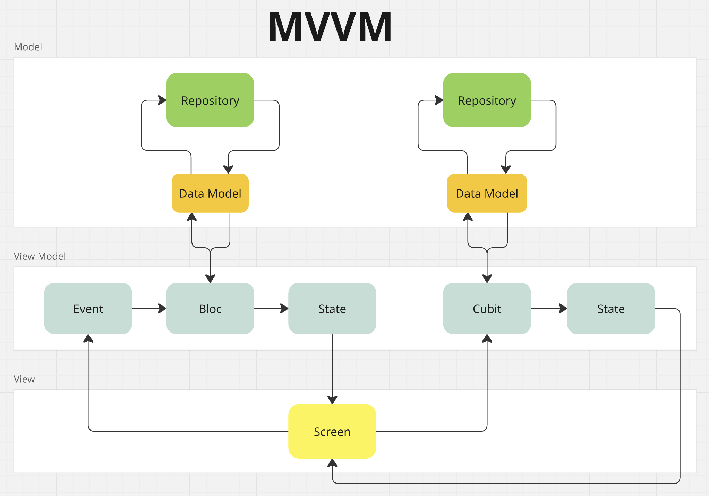

# Flutter: MVVM With Bloc

**Nôi dụng bao gồm:**

- [Flutter: MVVM With Bloc](#flutter-mvvm-with-bloc)
  - [1. MVVM Design pattern](#1-mvvm-design-pattern)
    - [Model](#model)
    - [View](#view)
    - [ViewModel](#viewmodel)
    - [Diagram](#diagram)
  - [2. Source Structure](#2-source-structure)

## 1. MVVM Design pattern

**MVVM (**Model - View - View Model**)** Là một mẫu kiến trúc phần mềm dùng để tách biệt business logics với ui logic và ui trong các ứng dụng. MVVM thường được sử dụng để phát triển ứng dụng đi động để tạo ra mã nguồn dễ bảo trì và kiểm thử.

**MVVM** bao gồm các thành phần sau:

### Model

**Model** là lớp chứa dữ liệu và business logics của ứng dụng. Nó đại diện cho dữ liệu ứng dụng và business rules liên quan đến dữ liệu đó.

- **Chức năng:**
  - Xử lý truy cập dữ liệu, bao gồm các hoạt động như lấy dữ liệu từ cơ sở dữ liệu hoặc từ API
  - Định nghĩa các lớp dữ liệu (data models) đại diện cho dữ liệu ứng dụng.
  - Chứa business logics.

### View

**View** là thành phần giao diện người dùng (UI). Nó nhận dữ liệu từ **ViewModel** và hiển thị dữ liệu cho người dùng

- **Chức năng:**
  - Hiển thị dữ liệu và nhận tương tác từ người dùng.
  - Không chứa các logic xử lý dữ liệu.

### ViewModel

**ViewModel** là lớp trung gian giữa **Model** và **View**. Nó nhận giữ liệu từ **Model**, xử lý dữ liệu đó và cung cấp cho **View.**

- **Chứ năng:**
  - Quản lý trạng thái của **View.**
  - Nhận các sự kiện từ **View** và yêu cầu **Model** thực hiện các hành động tương ứng.
  - Chuyển đổi dữ liệu từ **Model** thành định dạng mà **View** có thể dễ dàng sử dụng.

### Diagram



## 2. Source Structure

```jsx
lib/
├── features/
│   ├── home/
│   │   ├── bloc/  // ViewModel
│   │   │   ├── home_bloc.dart
│   │   │   ├── home_event.dart
│   │   │   ├── home_state.dart
│   │   ├── data/  // Model
│   │   │   ├── models/  // Data Models
│   │   │   │   ├── product_model.dart
│   │   │   ├── repository/  // Repositories
│   │   │   │   ├── home_repository.dart
│   │   ├── views/  // Views
│   │   │   ├── home_screen.dart
│   │   ├── widgets/  // Custom Widgets
│   │   │   ├── custom_widget.dart
├── core/
│   ├── network/  // Network services
│   │   ├── dio_config.dart
│   │   ├── dio_interceptors.dart
│   │   ├── network_client.dart
│   │   ├── network_client.g.dart
│   ├── constants/ // Constants
│   │   ├── app_constants.dart
├── main.dart
```
